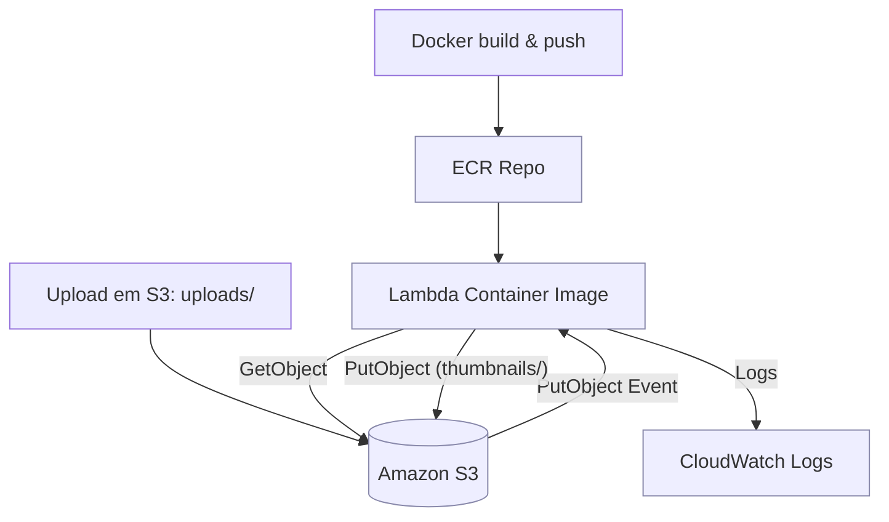

# 🧪 Laboratório: Lambda (Container Image) + ECR + S3 — Thumbnails

## 🎯 Objetivo
- Criar uma função AWS Lambda baseada em imagem Docker publicada no ECR.
- Reagir a uploads no S3 (`uploads/`), gerar thumbnails e salvar em `thumbnails/`.
- Demonstrar o fluxo completo: Local → ECR → Lambda.

## ✅ Resultados esperados
- Upload em `s3://lab-thumbnail-s3-lambda-marlonanesi/uploads/arquivo.jpg` dispara a Lambda.
- Lambda gera thumbnail (lado máx. configurável) e grava em `s3://lab-thumbnail-s3-lambda-marlonanesi/thumbnails/`.
- Logs disponíveis no CloudWatch.

---

## 🏗️ Arquitetura e fluxo



📂 **Estrutura no S3**

- `uploads/` → entrada (evento PutObject).
- `thumbnails/` → saída da Lambda.

⚙️ **Variáveis de ambiente**

- `MAX_THUMB_SIZE`: lado máximo da thumbnail (ex.: 256).

---

## 🔹 Parte 1 — Testando localmente

**Pré-requisitos**

- AWS CLI - instalado e com usuário de aplicação autenticado e com permissão
- Arquivos: handler.py, requirements.txt, event-s3-sample.json.
- Dependência: Pillow (no requirements.txt).

**Passos**

- Crie um ambiente virtual ou instale diretamente no seu python as dependencias do requirements "pip install -r requirements.txt"
- Ter o bucket criado com a estrutura, pastas thumbnails e uploads
- Ter o AWS CLI instalado e com usuário autenticado com permissão
- Ter o Python instalado para rodar o handler.py (descommitar observação no final do handler para teste local)
- Configurar parametros no event-s3-sample.json (simular flow de event lambda), com nome do bucket e caminho da imagem
- Rodar o handler.py e verificar se foi criada a miniatura na pasta uploads

**Beneficios da abordagem**
- Testar a lambda localmente antes de subir, possível mockar insumos/atributos e simular o cenário produtivo, debugar o código e etc...

---

## 🔹 Parte 2 — Publicando no ECR

- Criar repositório no ECR
- Possível via interface da console ou via linha de comando, o que vc preferir

  ```sh // caso queira criar via cli
  aws ecr create-repository --repository-name lab/lambda-s3-thumbnail --region sa-east-1
  ```

- Comandos (Windows PowerShell ou Linux/macOS)

  ```sh
  $env:DOCKER_BUILDKIT=0
  aws ecr get-login-password --region sa-east-1 | docker login --username AWS --password-stdin 351799164530.dkr.ecr.sa-east-1.amazonaws.com ## copie no seu ECR para auth
  docker build --platform linux/amd64 -t lab/lambda-s3-thumbnail:latest .
  docker tag lab/lambda-s3-thumbnail:latest 351799164530.dkr.ecr.sa-east-1.amazonaws.com/lab/lambda-s3-thumbnail:latest
  docker push 351799164530.dkr.ecr.sa-east-1.amazonaws.com/lab/lambda-s3-thumbnail:latest
  ```

- Verificar tipo de manifesto (tem que ser simples, não index)

  ```sh
  aws ecr describe-images --repository-name lab/lambda-s3-thumbnail --image-ids imageTag=latest --region sa-east-1 --query 'imageDetails[0].imageManifestMediaType'
  ```

✅ **Esperado:**  
`application/vnd.docker.distribution.manifest.v2+json` ou `application/vnd.oci.image.manifest.v1+json`.

---

**Role IAM (mínima)**

- Criar uma política com as instruções abaixo, é possível granularizar mais mas para esse lab não é necessário
- Criar uma role/função, que será atribuida a Lambda na hora da criação (selecione a existente previamente criada
)
```json
{
  "Version": "2012-10-17",
  "Statement": [
    {
      "Effect": "Allow",
      "Action": ["logs:CreateLogGroup","logs:CreateLogStream","logs:PutLogEvents"],
      "Resource": "*"
    },
    {
      "Effect": "Allow",
      "Action": ["s3:GetObject"],
      "Resource": "<arn do seu bucket>/uploads/*"
    },
    {
      "Effect": "Allow",
      "Action": ["s3:PutObject"],
      "Resource": "<arn do seu bucket>/thumbnails/*"
    },
    {
      "Effect": "Allow",
      "Action": ["ecr:GetDownloadUrlForLayer","ecr:BatchGetImage","ecr:BatchCheckLayerAvailability"],
      "Resource": "*"
    }
  ]
}
```
## 🔹 Parte 3 — Criando a Lambda + gatilho S3

**Evento S3, no bucket > propriedades >  Criar evento de notificação**

- Evento: PUT
- Prefix: uploads/
- Suffix: .jpg, .png
- No final selecionar sua Lambda

**Teste**

- Upload em uploads/ → gera thumbnail em thumbnails/ (subir imagem manualmente na uploads, deve trigar a lambda e gerar a miniatura)
- Logs em CloudWatch

---

## 🔍 Observabilidade

- CloudWatch Logs para erros.
- Métricas automáticas da Lambda (invocations, duration, errors).

---

## 💡 Benefícios de usar Container Image

- Inclui libs nativas (Pillow).
- Tamanho até 10 GB.
- Mesmo código roda local + CI/CD + Lambda.
- Controle explícito do runtime.

---

## ⚠️ Cuidados

- Se tiver problemas pra criar a lambda com a imagem docker, revise os steps para evitar multiarch e criar somente o tipo compativel com a lambda
- Se vc testou local, lembre de comentar o final do codigo no handler.py (utilizado somente pra execução local baseado no event-s3-sample.json)
- Se implementar tudo e ver que o flow não acontece e nem gera logs no cloudwatch, revise a politica se ela está correta com os arns do bucket
- Imagens grandes = mais cold start.
- Manter base atualizada.
- Custos de ECR + tráfego.


